# Filament Sidekick

[](https://packagist.org/packages/devletes/filament-sidekick)
[](https://packagist.org/packages/devletes/filament-sidekick)
[](https://packagist.org/packages/devletes/filament-sidekick)
[](https://github.com/devletes/filament-sidekick/stargazers)

A push-aside AI assistant panel for Filament 5 panels.

- Pushes the page aside instead of covering it — content reflows, nothing is hidden
- Turns run on the queue and stream back, with live tool activity
- Read tools and confirmable write actions are one class each, auto-discovered
- The model can only *propose* writes; execution needs the user's Confirm click
- Per-panel tools, per-panel assistants, multi-tenant safe
- Attachments whose contents never reach the LLM
- Filament components throughout, plus a `--sidekick-*` CSS theming surface

<table><tr>
<td width="50%">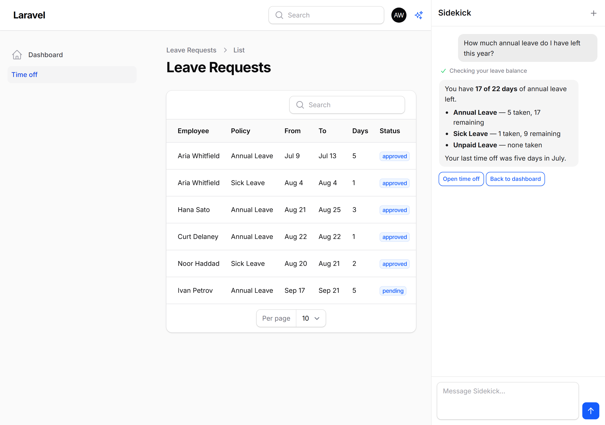</td>
<td width="50%">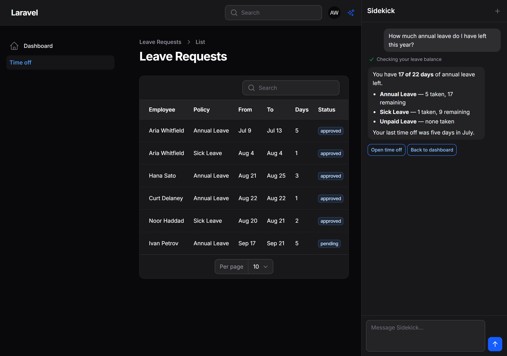</td>
</tr></table>

## Requirements

- PHP `^8.2`
- Filament `^5.0`
- `laravel/ai` `^0.7` with a configured provider
- A queue worker — turns are queued jobs

## Installation

```bash
composer require devletes/filament-sidekick
```

```bash
php artisan sidekick:install
```

The installer publishes the config and runs the migrations. Register the plugin on your panel:

```php
use Devletes\Sidekick\SidekickPlugin;

return $panel->plugins([
    SidekickPlugin::make(),
]);
```

Set a `laravel/ai` provider key in `.env` and run `php artisan queue:work`. That's a working assistant — it just has no tools yet.

<table><tr>
<td width="50%">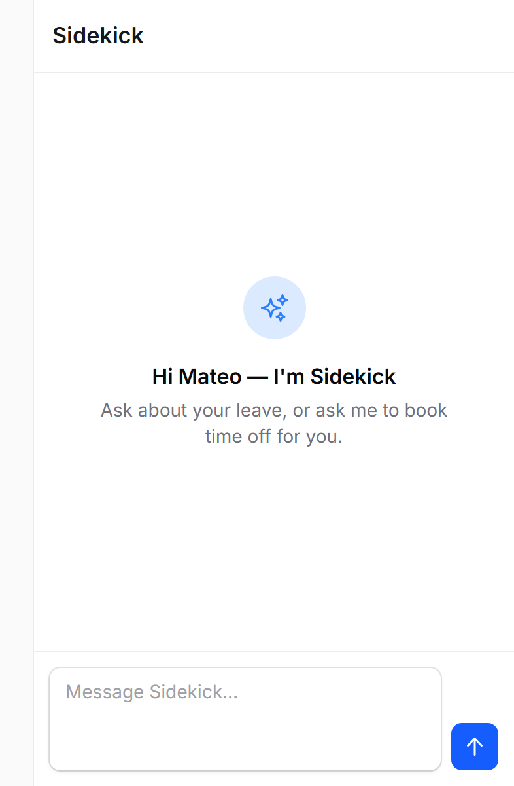</td>
<td width="50%">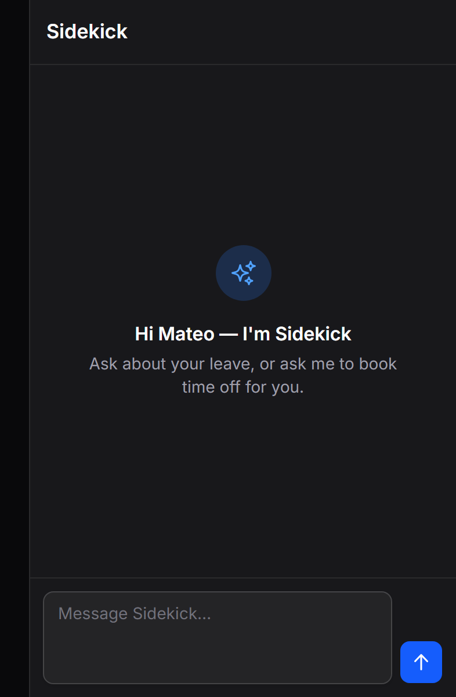</td>
</tr></table>

> A turn's job timeout is `sidekick.timeout` + 60s. Your queue connection's `retry_after` must be larger, or a slow turn gets redelivered mid-stream.

## Tools (reads)

```bash
php artisan sidekick:tool LeaveBalances
```

```php
namespace App\Sidekick\Tools;

use Devletes\Sidekick\Support\ChatToolBase;
use Illuminate\Contracts\JsonSchema\JsonSchema;
use Laravel\Ai\Tools\Request;

class LeaveBalances extends ChatToolBase
{
    public function description(): string
    {
        return "The signed-in employee's leave balance per policy: entitled, taken, remaining.";
    }

    public function schema(JsonSchema $schema): array
    {
        return [];
    }

    public function label(): string
    {
        return 'Checking your leave balance';
    }

    public function handle(Request $request): string
    {
        // $this->user is the chatting user — scope every query to them.
        return $this->respond(['balances' => LeaveBalance::for($this->user)]);
    }
}
```

Classes in `app/Sidekick/Tools` are auto-discovered — there is no registration step. The panel shows each tool's `label()` while it runs, then renders the reply as markdown.

<table><tr>
<td width="50%">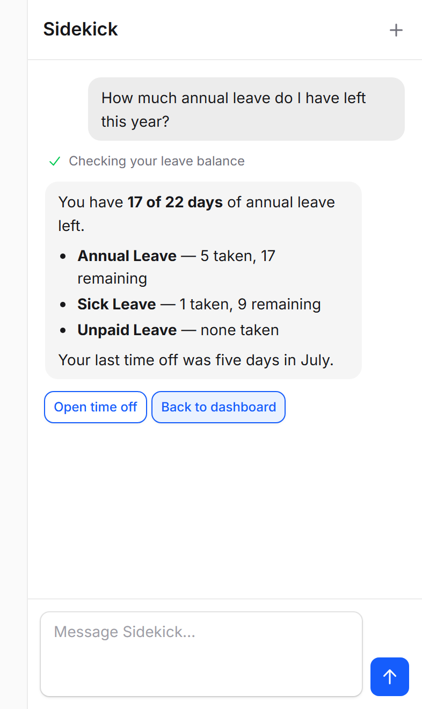</td>
<td width="50%">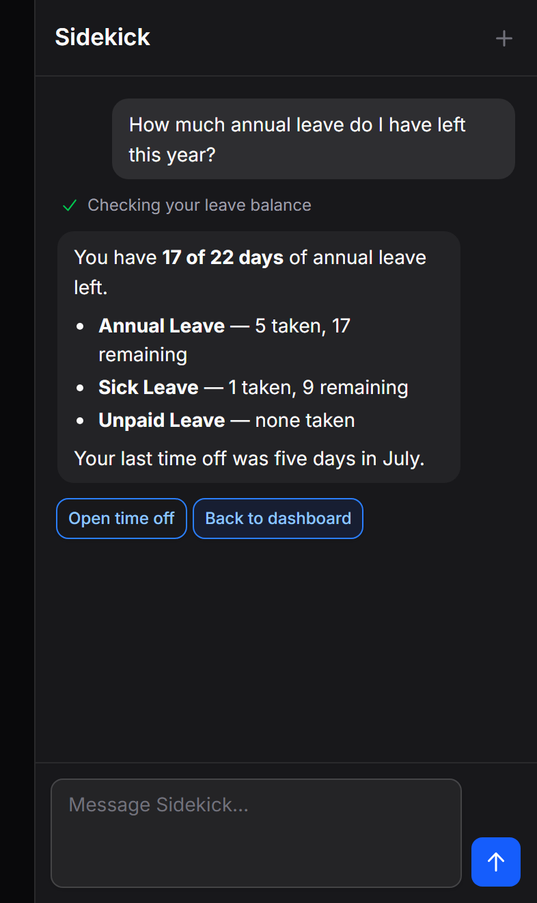</td>
</tr></table>

Optional overrides:

| Method | Notes |
|---|---|
| `authorize($user)` | Unauthorized users are never offered the tool. Defaults to everyone |
| `label()` | Status line in the panel. Defaults to the class name |
| `instructions()` | System-prompt guidance added while this tool is offered. Hard-coded text only — never interpolate user or record data |
| `panels()` | Panel ids that offer this tool. Defaults to `['*']` |

## Actions (writes)

Writes never run from the model. An action is one class extending `Support\SidekickAction`, and Sidekick offers it to the model as a `Propose{ClassName}` tool. `prepare()` validates the payload into a confirmation card; `execute()` runs only on the user's Confirm click, under their session.

```bash
php artisan sidekick:action RequestTimeOff
```

```php
class RequestTimeOff extends SidekickAction
{
    public function description(): string
    {
        return 'Book time off for the signed-in employee.';
    }

    public function schema(JsonSchema $schema): array
    {
        return [
            'policy' => $schema->string()->required(),
            'from' => $schema->string()->required(),
            'to' => $schema->string(),
        ];
    }

    public function prepare(array $payload, Authenticatable $user): array
    {
        // Throw InvalidArgumentException — the message goes back to the model to self-correct.
        $days = $this->workingDays($payload['from'], $payload['to'] ?? $payload['from']);

        return [
            'payload' => [...$payload, 'days' => $days],
            'summary' => "Book {$days} days of annual leave",
            'preview' => [
                ['label' => 'Working days', 'value' => (string) $days],
                ['label' => 'Balance after', 'value' => '7 of 22 days'],
            ],
        ];
    }

    public function execute(array $payload, Authenticatable $user): string
    {
        LeaveRequest::create([...$payload, 'user_id' => $user->getAuthIdentifier()]);

        return 'Submitted for approval.';
    }
}
```

The card replaces the composer until answered. Confirming is claimed atomically, so a second tab cannot execute the same action twice.

<table><tr>
<td width="50%">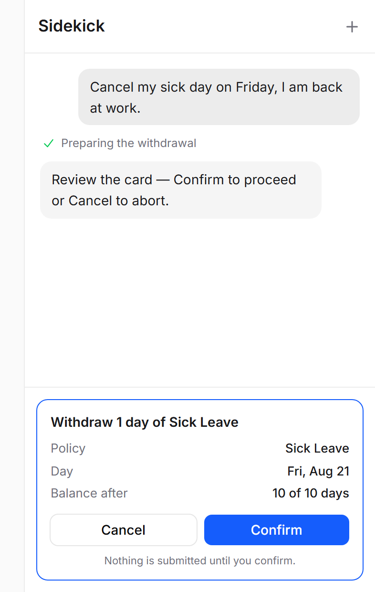</td>
<td width="50%">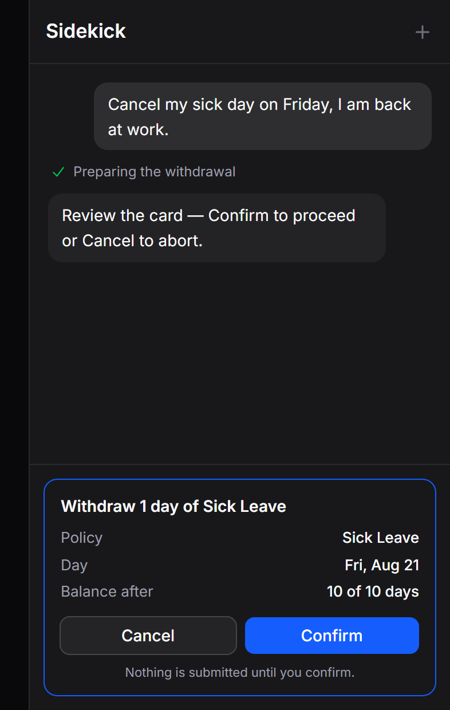</td>
</tr></table>

Answered cards leave a system-verified outcome in the timeline. Those outcomes are the only thing the model is told about what happened, so it can never claim success on its own.

<table><tr>
<td width="50%">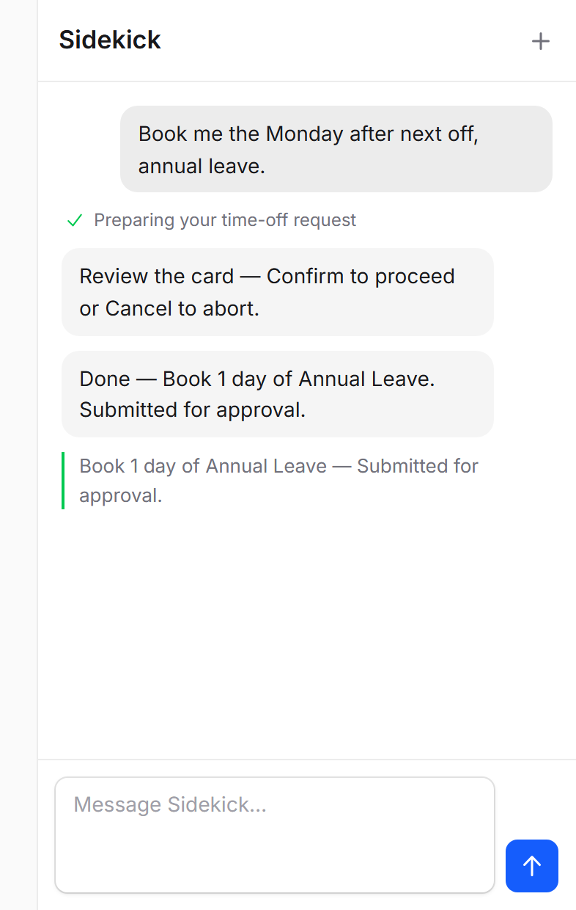</td>
<td width="50%">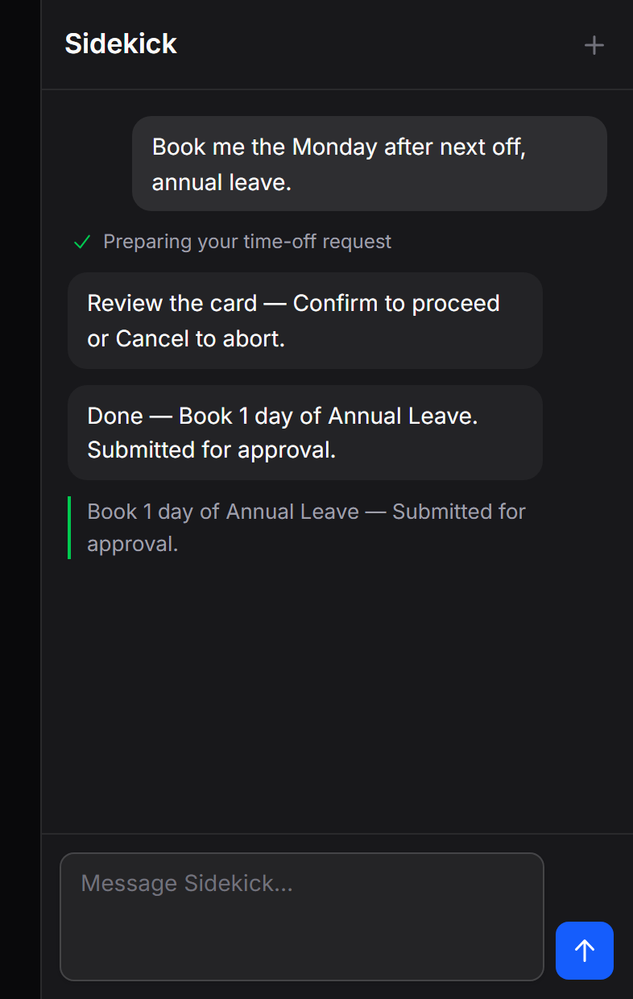</td>
</tr></table>

Overridable conventions: `type()` (defaults to the snake_cased class name), plus `authorize()`, `label()`, `instructions()`, and `panels()` as above.

### Inline or modal

Confirmations render inline by default. When a preview is too tall or wide for the panel, return `ConfirmationMode::Modal` and the card opens in a modal over the page instead:

```php
use Devletes\Sidekick\Enums\ConfirmationMode;

public function confirmation(): ConfirmationMode
{
    return ConfirmationMode::Modal;
}
```

<table><tr>
<td width="50%">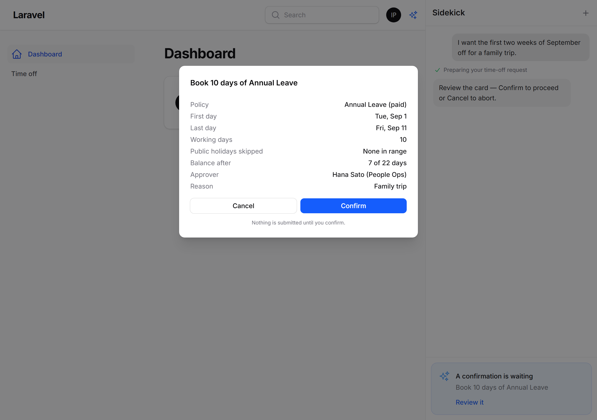</td>
<td width="50%">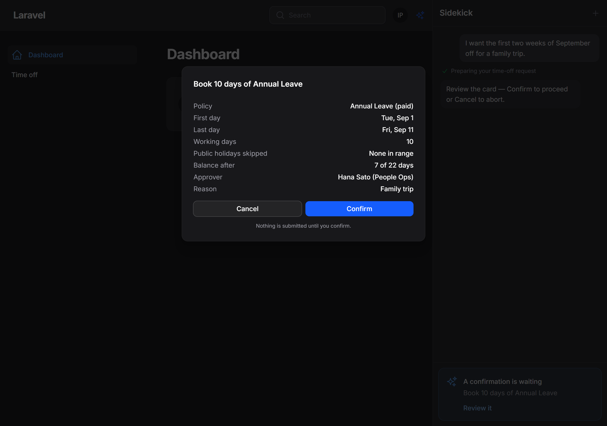</td>
</tr></table>

The modal can't be clicked, escaped, or closed away — answering it is the only way out. A page reload still escapes it, so the panel keeps a link back in until the card is confirmed or cancelled. For the same reason modals never spring open on page load; they open only when the proposal arrives while you are looking at the panel.

<table><tr>
<td width="50%">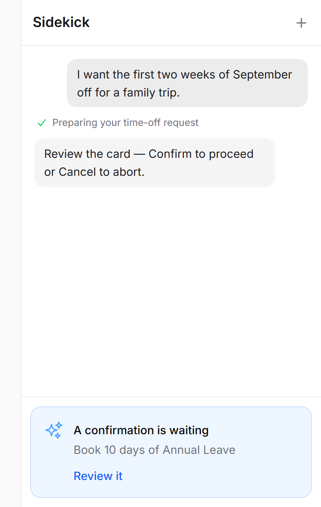</td>
<td width="50%">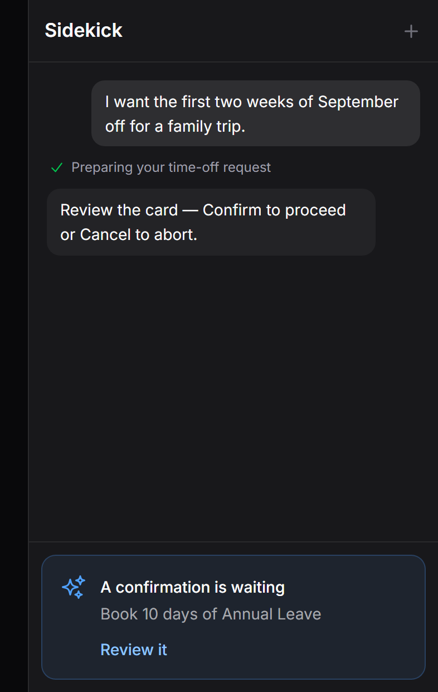</td>
</tr></table>

## Registering tools & actions

Three composable sources, deduplicated:

1. **Discovery** *(default)* — any class in `app/Sidekick/Tools` or `app/Sidekick/Actions`. Paths and kill switch under `sidekick.discover`.
2. **Config** — class arrays in `sidekick.tools` / `sidekick.actions`. Also how a profile gets its own tool set.
3. **Runtime** — `Sidekick::tools([...])` from any service provider, for packages contributing tools. Works in web requests and queue workers alike.

## Navigation

`Navigate` (redirect when the reply finishes) and `PresentActions` (buttons under a reply) ship with the package. Both wake once you point at an `ActionResolver`, which maps named targets to authorized URLs:

```php
// config/sidekick.php
'action_resolver' => \App\Sidekick\ResourceResolver::class,
```

Opt out per tool under `sidekick.builtin_tools`. Model-authored button URLs are restricted to `http(s)`.

## Scaffolding

```bash
php artisan sidekick:scaffold
```

Generates a `Search{Models}` tool per Filament resource plus one `ResourceResolver` (tenant-aware when the panel has tenancy). `--actions` also scaffolds `Create{Model}` stubs, which throw until you implement `execute()`. `--dry-run` previews.

Output is a starting point, not finished code — every file carries TODOs, notably `authorize()`. Re-runs never overwrite existing files. Scope with `sidekick.scaffold.only` and `sidekick.scaffold.ignore`.

## Streaming

The panel shows each tool as it is called and reveals the reply as it streams. Turns survive full page navigations — progress lives on the run row, not in component state.

<table><tr>
<td width="50%">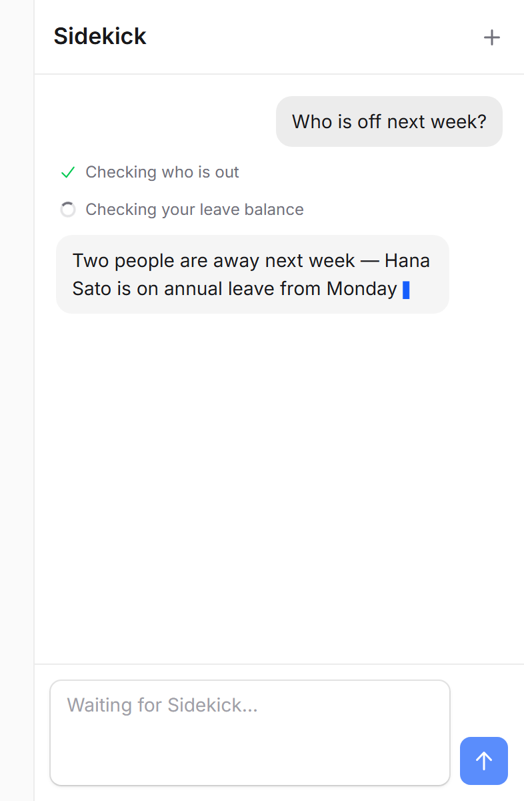</td>
<td width="50%">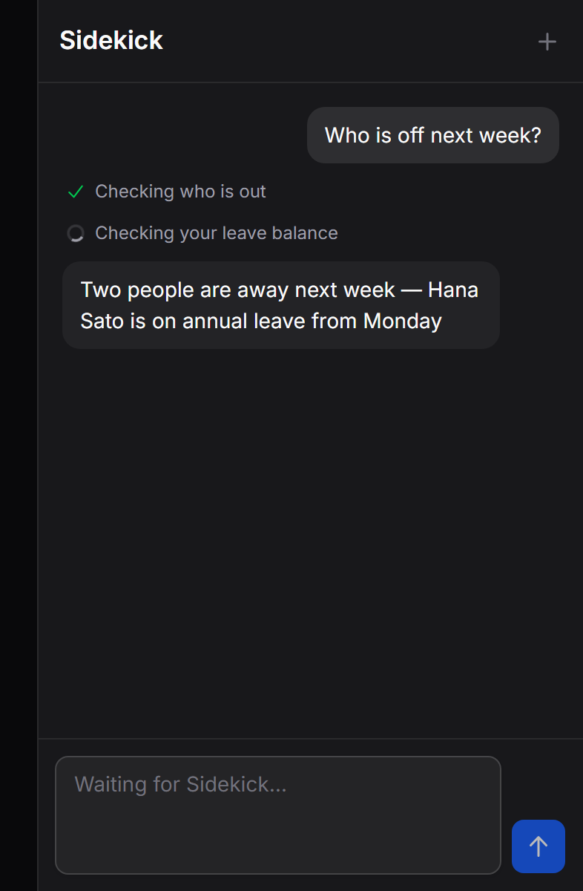</td>
</tr></table>

Polling (`2s`, only while a turn is active) is the default and needs nothing installed. Set `SIDEKICK_BROADCASTING=true` to push updates over Reverb/Pusher instead; polling stays on as a safety net at `polling.while_broadcasting` (`10s`), and a broadcast failure never fails a turn.

## Panels & multi-tenancy

`panels()` scopes any tool or action to specific panels — `['admin']` keeps it out of every other assistant.

Chat turns run in a worker, where Filament has no idea which panel or tenant the message came from. Sidekick captures the serving panel, tenant, and auth guard at dispatch and restores all three, so `Filament::getTenant()` and tenant-scoped queries behave as they do in the panel. Context is always rewritten — including cleared — so a long-lived worker never inherits the previous job's tenant.

## Profiles

Different panels can run different assistants off one install. Define named override sets in `sidekick.profiles` — each entry's top-level keys replace the base config — and attach one per panel:

```php
SidekickPlugin::make()->profile('boss')
```

Conversations are stamped with their profile, so each panel keeps its own history and a queued turn runs under the assistant it started with.

## Attachments

Set `sidekick.attachments.enabled` to let users attach files in the composer and on confirm cards. Files are validated (`accept`, `max_size`, `max_files`) and stored on a private disk.

The model only ever sees metadata — name, mime, size, and an `attachment_id` — so attachments cost a handful of tokens regardless of file size. Accept `attachment_ids` in a schema and resolve with `Attachment::query()->forUser($user)`, always re-proving ownership. An action's `prepare()` may return an `upload` spec (`['required' => true, 'label' => 'Receipt']`) to put a file field on the card.

Storage is temporary: schedule `sidekick:prune-attachments` daily and it deletes every upload older than `prune_after_hours`. A confirmed action should copy what it needs into your own storage.

## Usage limits

Sidekick meters every turn onto `sidekick_runs.usage` but enforces nothing. Implement `Contracts\UsageLimiter` and point at it:

```php
class TenantPlanLimiter implements UsageLimiter
{
    public function check(Authenticatable $user, ?string $conversationId): ?string
    {
        return $this->overBudget($user)
            ? 'Daily assistant limit reached — try again tomorrow.'
            : null;
    }
}
```

```php
// config/sidekick.php
'usage_limiter' => \App\Sidekick\TenantPlanLimiter::class,
```

Return `null` to allow, or a message to deny — shown to the user verbatim, with Retry suppressed. The check runs in the panel before a turn is created and again in the job, before any tokens are spent.

## Theming

Chrome comes from Filament's own Blade components, so the panel follows your panel's theme with no configuration. Everything else is a CSS custom property — declare any `--sidekick-*` on `body` in your theme stylesheet and it wins over the defaults. No PHP API needed.

```css
body {
    --sidekick-width: 26rem;
    --sidekick-bubble-user-bg: #e0e7ff;
    --sidekick-bubble-radius: 1.25rem;
}
```

| Variable | Notes |
|---|---|
| `--sidekick-width` / `--sidekick-top` / `--sidekick-height` | Panel geometry. Width is also settable via `sidekick.panel.width` |
| `--sidekick-edge-offset` | How far the aside climbs the layout's vertical padding in full-height mode |
| `--sidekick-bg` / `--sidekick-border` / `--sidekick-text` / `--sidekick-muted` | Panel surfaces |
| `--sidekick-bubble-user-bg` / `--sidekick-bubble-assistant-bg` / `--sidekick-bubble-radius` | Message bubbles |
| `--sidekick-composer-field-min` / `--sidekick-composer-btn-px` / `--sidekick-composer-btn-min` | Composer textarea and icon buttons |

Panel state is mirrored onto `<body>` as `sidekick-open`, `sidekick-full-height`, and `sidekick-ready` — use them to move your own chrome out of the way:

```css
body.sidekick-open .my-floating-button { right: calc(var(--sidekick-width) + 1rem); }
```

Set `sidekick.panel.full_height` to run the panel edge-to-edge instead of below the topbar.

<table><tr>
<td width="50%">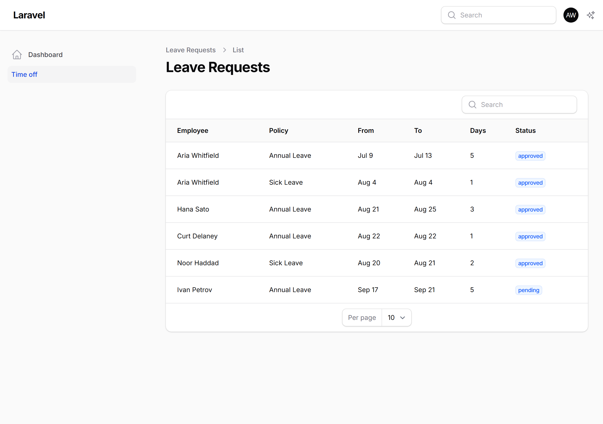</td>
<td width="50%">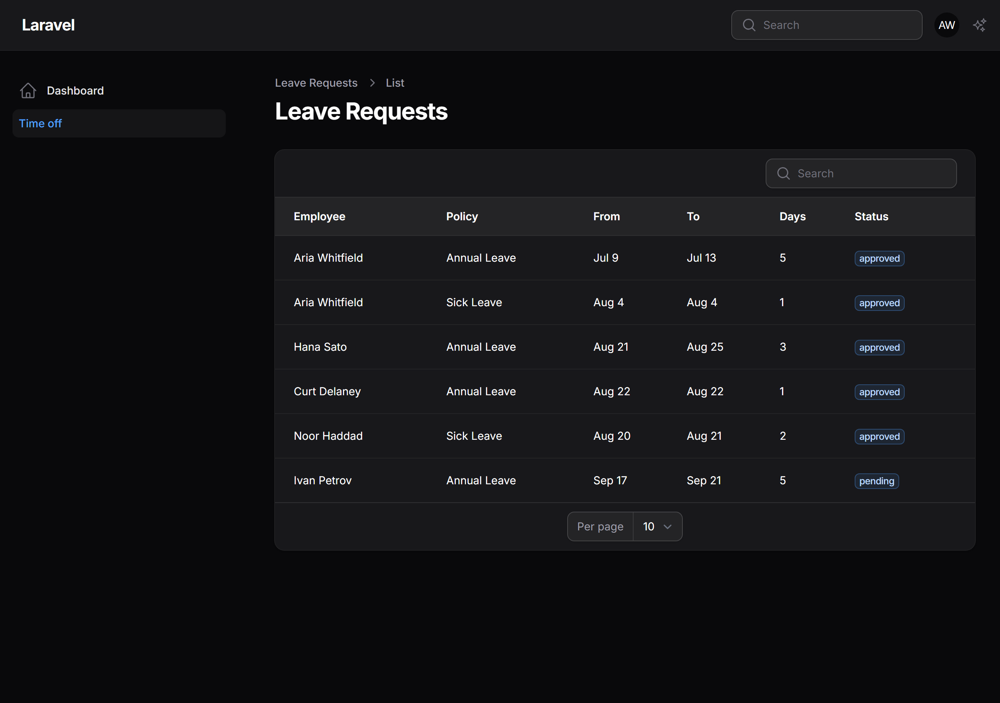</td>
</tr></table>

### Icons

Every icon is configurable under `sidekick.icons` and defaults to a Heroicon: `assistant`, `new_conversation`, `close`, `attach`, `send`, `remove`, `tool_done`.

The toggle button can also be set per panel — an icon name, or raw SVG for a custom logo:

```php
SidekickPlugin::make()->icon('heroicon-o-chat-bubble-left-right')
SidekickPlugin::make()->icon(view('icons.my-logo'))
```

## Extension points

| Seam | Purpose |
|---|---|
| `config/sidekick.php` | Agent class, assistant identity, instructions, model, queue, broadcasting, geometry |
| `Contracts\ChatTool` / `ProposableAction` | Read tools and confirmable writes — extend the base classes instead |
| `Contracts\ActionResolver` | Named navigation targets → authorized URLs |
| `Contracts\UsageLimiter` | Per-user or per-tenant limits |
| `Support\SidekickContext` | Stamp extra columns onto conversations and scope conversation queries |
| `sidekick.jobs.run` | Subclass `RunChatTurn` for app concerns like metering |

## Need something custom?

We build production Filament panels and plugins for teams that want to ship fast without compromising on polish. If you need a custom feature, an extended variant of this package, or a fully bespoke component built for your stack, we can help.

- **Browse the rest of our Filament work:** [filament.devletes.com](https://filament.devletes.com)
- **Get in touch:** [salman@devletes.com](mailto:salman@devletes.com)

Typical engagements: new Filament plugins, custom resources/widgets/actions, theme + UX work, integrations with your existing services, and one-off tailored forks of our open-source packages.

## Credits

- [Salman Hijazi](https://www.linkedin.com/in/syedsalmanhijazi/)

## License

MIT. See [LICENSE.md](LICENSE.md).
